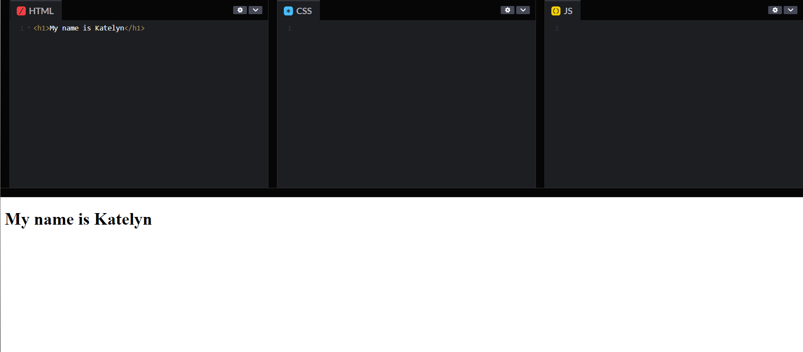

# WEEK 1 HTML INTRO

## About you page!

Welcome to week one! We will introduce the basics of HTML and a little preview of CSS.

## Table of Contents

- [Introduction](#introduction)
- [Step-by-Step Guide](#step-by-step-guide)
  - [1. Start off the HTML](#1-start-off-the-html)
  - [2. CSS](#2-css)
- [Stretch Goals](#stretch-goals)
- [Conclusion](#conclusion)


## Introduction


In this tutorial you will learn how to make an 'About You' page using HTML and a preview of CSS.

## Step-by-Step Guide

### 1. Start off the HTML

Go to [codepen.io](codepen.io) and clear your code so you can start fresh! On the HTML area, create an h1 element by typing h1, then pressing tab!

This will create something that looks like this:

```
<h1></h1>
```
h1 means Header 1, the biggest of the headers, perfect for a title! In between the carrots (> and <), type in a title for your about me website.

```
<h1>My name is Katelyn</h1>
```
Now your preview should look something like this:



### Sub Header
To make a sub header we will create another tag called header 2, (```<h2></h2>```). Type h2 and press tab. Header 2 is a little smaller than header 1. Write down the school you go to in it.

It should look like this:

```
<h1>My name is Katelyn</h1>
<h2>I go to University of Hawaii At Manoa</h2>
```


### Paragraph

Now it's time to create a paragraph about yourself! Talk about your favorite food, your favorite animal and why you joined this class! To make a paragraph, use the ```<p>``` tag (type p, and press tab!).


### Add an image

Add an image of your favorite animal. Create an image tag by typing img and pressing tab. It'll create different this time:

```

```

Image tags are different from the other tags, because you don't put text in between two carrots this time. Instead, you have to put a **source** of the image you want into the tag. But how do we get an image source?

Let's go to google and find a picture of your favorite animal. Click on the images button and select the image that speaks to you! Make sure to click on it to zoom it in.

  

Right click on the picture and find the option that says copy **image** address (or copy **image** link). Go back to your codepen and paste the image address into the **src** field, in between the quotes (**""**)

```

```

**_NOTE:_**  Sometimes the image that you used doesn't behave and won't load. If it happens, try another image, or ask a mentor to make sure you're getting the right __image address__. 

If everything went well, you might end up with something like this:


Sometimes the image is really big, and we need to make it smaller. We can use CSS to make it the size we want!


### 2. CSS

Now, head over to the CSS box. This is a different language than HTML, so things will look a lot different. For now, we'll just use this to change the picture size.

To use CSS, we need to first say what tag we're going to change, the "target". We do this but just typing the tag that we want. We want to change the img tag, so...

```
img
```

After saying what you want to change, make a space, type in the open curly brace ```{``` (shift + ```[``` ), then press Enter. If you do this right, you'll have made something that looks like this:

```
img {

}
```

Now, anything we put in between the two curly braces will affect the img tag! Since we want to change the size, we'll have to use the **width** tag (not  the size tag?? 👀). Type width, then a colon ```:```, a space, then the size of your image. Let's try a size of 200 pixels (200px).

```
img {
  width: 200px;
}
```

**_NOTE:_** With CSS, each CSS property needs to have a semicolon ```;``` at the end of it. The semicolon tells the CSS that you're done writing in that line. If you forget the semicolon, it can cause problems when you add more and more properties, so don't forget!


Much better! 


## Stretch Goals
If you're finished, there's a couple of extra things you can try if you want to see what HTML can do. 
- Play around with the ```<a>``` tag. It's like a ```<p>``` tag, but has an ```href``` property. Write some text in between the carrots and put a website link like [google.com](google.com) into the href quotes, and see what happens.
- Mess around with lists. This bunch of code will make a bullet point list of whatever you want: 

```
<ul>
  <li>I've</li>
  <li>Played</li>
  <li>These</li>
  <li>Games</li>
  <li>Before</li>
</ul>
```

- Try to add as many pictures to your website as you can. If you're in a group, try to beat them by having more pictures!
- Try to change the color of your text by using the ```color:``` property in CSS

## Conclusion

Congratulations! You've created a simple website using HTML and a little bit of CSS. This is just the beginning – there are many more features and technologies to explore. Keep learning and experimenting to build more complex and dynamic websites.

Feel free to reach out if you have any questions or feedback. Happy coding!
